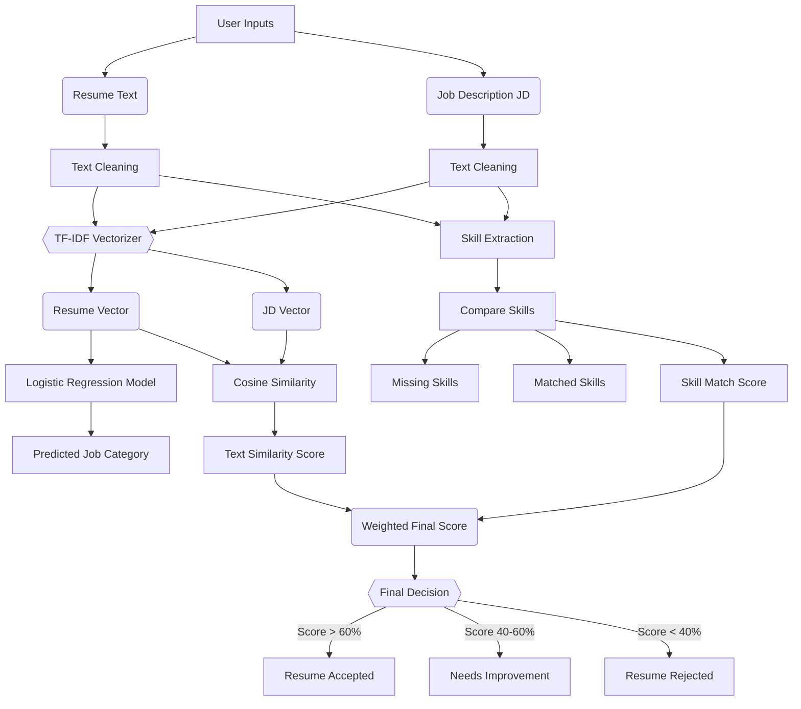

# 🚀 AI Resume Analyzer

An intelligent Streamlit-based web application that leverages Natural Language Processing (NLP) and Machine Learning to evaluate candidate resumes against job descriptions.

## ✨ Features
- **Smart Categorization:** Uses an NLP model to classify a resume into roles like Data Scientist, Software Engineer, HR, Mechanical Engineer, etc.
- **Skill Extraction:** Automatically extracts key technical skills (Python, TensorFlow, AWS, React, etc.) from both the resume and the job description.
- **Match Scoring:** Calculates a weighted match score based on both semantic similarity (TF-IDF + Cosine Similarity) and exact skill overlaps.
- **Actionable Insights:** Explicitly highlights matched skills and missing skills, providing a definitive hiring decision (Accepted, Needs Improvement, Rejected).
- **Premium UI:** A modern, dark-themed UI with clean metric cards, gradient buttons, and responsive grid layouts.

## 🔄 System Flowchart


## 🛠️ Tech Stack
- **Frontend:** Streamlit
- **Machine Learning:** Scikit-learn (Logistic Regression, TF-IDF Vectorizer)
- **Data Processing:** Pandas, Numpy, Regex
- **Serialization:** Pickle

## 🚀 Getting Started

### Prerequisites
Make sure you have Python installed. You can install the required dependencies using:

```bash
pip install streamlit scikit-learn pandas numpy
```

### Running the App
Start the Streamlit development server by running:

```bash
streamlit run app.py
```


## 🧠 Model Training
The model requires `model.pkl` and `tfidf.pkl` to function. If you want to retrain the categorization model, simply run the training script on your dataset:
```bash
python train_model.py
```
This script vectorizes the text using TF-IDF, trains a Logistic Regression classifier, and exports the models to pickle format.
